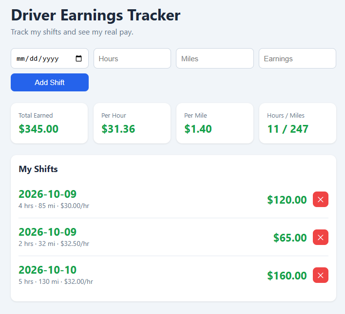

# 🚗 Driver Earnings Tracker

A web app for delivery drivers to log shifts and see their **real pay per hour and per mile**.

🔗 **Live demo:**  https://driver-earnings.vercel.app/



## Why I built it
As a delivery driver and wanted to know which shifts actually pay best once hours and miles are counted, not just the total payout.

## Features
- Add shifts with date, hours, miles, and earnings
- See total earnings, pay per hour, and pay per mile
- Pay per hour shown for every shift
- Delete shifts
- Data saved in the browser (localStorage)
- Form validation and responsive layout for mobile
- Edit and delete shifts
- Charts: net earnings by day and best days to drive

## Built with
- React
- TypeScript
- Vite
- CSS
- Deployed on Vercel
- Recharts

## What I learned
- Building reusable components and passing data with props
- Managing state with `useState` and side effects with `useEffect`
- Typing data and props with TypeScript interfaces
- Controlled forms and validation
- Saving data with localStorage
- Git, GitHub, and deploying with Vercel
- Full CRUD operations with Supabase (insert, select, update, delete)

## Run it locally
```bash
git clone https://github.com/liaqataliqasemi/driver-earnings.git
cd driver-earnings
npm install
npm run dev
```

## Future improvements
- Charts for earnings by day and week
- Edit existing shifts
- Separate tips from base pay
- Cloud database so data syncs across devices